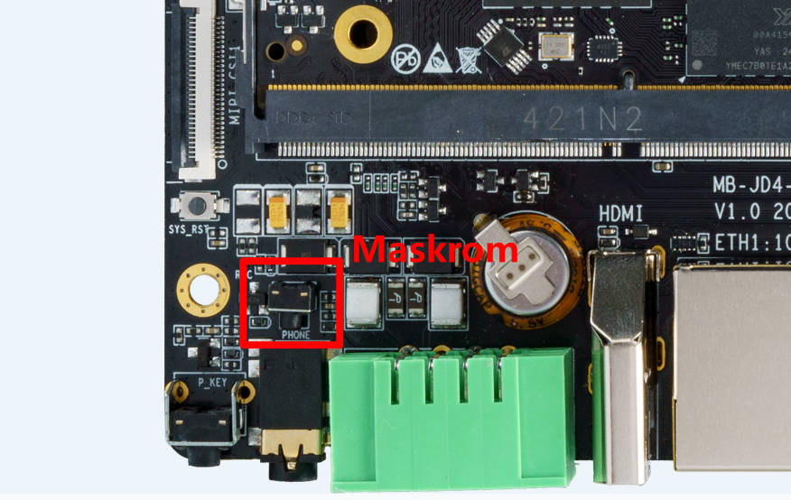

# MaskRom mode

***See startup mode for an introduction [startup mode](upgrade_bootmode.md)***

`MaskRom` pattern is the last line of defense equipment burn out. Forced entry `MaskRom` involved hardware operation, have certain risk, so only in the equipment into the `Loader` mode, can try `MaskRom` mode.

**Please read carefully and operate carefully!**

The operation steps are as follows:

Disconnect the power, press and hold Maskrom button, plug in the power, release button after few seconds.

If the product comes with the case, you can press Maskrom button through headphone jack with a thin stick.

At this point, the device should go into `MaskRom mode`.

