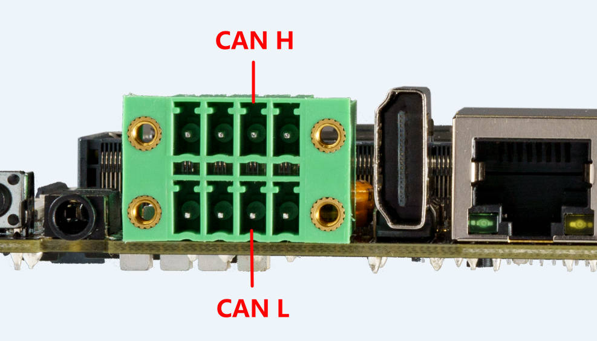

## CAN
### Introduction
Controller area network (can) is a kind of serial communication network which can effectively support distributed control or real-time control. Can bus is a bus protocol widely used in automobile, which is designed as the communication of microcontroller in automobile environment.
* Check [TI application report for more](https://www.ti.com/lit/an/sloa101b/sloa101b.pdf)
### Hardware Connection
Connection between two CAN devices, only need CAN_H to CAN_H, CAN_L to CAN_L.



### DTS Configuration
* Common `kernel/arch/arm64/boot/dts/rockchip/rk3576.dtsi`

```
    can0: can@2ac00000 {
            compatible = "rockchip,rk3576-canfd";
            reg = <0x0 0x2ac00000 0x0 0x1000>;
            interrupts = <GIC_SPI 121 IRQ_TYPE_LEVEL_HIGH>;
            clocks = <&cru CLK_CAN0>, <&cru HCLK_CAN0>;
            clock-names = "baudclk", "apb_pclk";
            resets = <&cru SRST_CAN0>, <&cru SRST_H_CAN0>;
            reset-names = "can", "can-apb";
            dmas = <&dmac0 20>;
            dma-names = "rx";
            status = "disabled";
    };

    can1: can@2ac10000 {
            compatible = "rockchip,rk3576-canfd";
            reg = <0x0 0x2ac10000 0x0 0x1000>;
            interrupts = <GIC_SPI 122 IRQ_TYPE_LEVEL_HIGH>;
            clocks = <&cru CLK_CAN1>, <&cru HCLK_CAN1>;
            clock-names = "baudclk", "apb_pclk";
            resets = <&cru SRST_CAN1>, <&cru SRST_H_CAN1>;
            reset-names = "can", "can-apb";
            dmas = <&dmac1 21>;
            dma-names = "rx";
            status = "disabled";
    };
```
* Board `kernel/arch/arm64/boot/dts/rockchip/rk3576-firefly-aio-3576jd4.dtsi`
```
&can0 {
        status = "okay";
        pinctrl-names = "default";
        pinctrl-0 = <&can0m2_pins>;
};
```

`assigned-clock-rates` can modify. If it is less than or equal to 3Mbps, it is recommended to modify the can clock to 100M, so that the signal is more stable. If it is higher than 3Mbps, the clock can be set to 200M.

### Communication
#### CAN communication test
Use the "candump" and "cansend" tools directly to send and receive messages, Ubuntu can use "apt update && apt install can-utils" to install them.

Android can push tools into /system/bin/ . Tools "candump/cansend" are included with the SDK and download from [Officail link](http://www.t-firefly.com/share/index/index/id/3cacb04c663f9fe97bf494ca55763dcd.html) or [github](https://github.com/linux-can/can-utils).

```
#Close the can0 device at the transceiver
ip link set can0 down
#Set the bit rate to 250Kbps at the transceiver                    
ip link set can0 type can bitrate 250000
#Show can0 details
ip -details link show can0
#Open the can0 device at the transceiver 
ip link set can0 up
#Perform candump on the receiving end, blocking waiting for messages               
candump can0
#Execute cansend at the sending end to send the message                         
cansend can0 123#1122334455667788
```

### More Command
```
1、 ip link set canX down 		//turn off CAN device
2、 ip link set canX up   		//turn on CAN device
3、 ip -details link show canX 		//show CAN device details
4、 candump canX  			//Receive data from CAN bus
5、 ifconfig canX down 			//shutdown CAn device
6、 ip link set canX up type can bitrate 250000 //Set CAN Baudrate
7、 conconfig canX bitrate + (Baudrate)
8、 canconfig canX start 		//start CAN device
9、 canconfig canX ctrlmode loopback on //loopback test
10、canconfig canX restart 		//restart CAN device
11、canconfig canX stop 		//stop CAN device
12、canecho canX 			//check CAN device status查看can设备总线状态；
13、cansend canX --identifier=ID+data 	//send data
14、candump canX --filter=ID:mask 	//Use the filter to receive ID matching data
```

### FAQS
Summarize several problems and solutions encountered during debugging.

#### The receiving end only successfully received the message once, and then no longer received the message
Check if the CAN_H and CAN_L lines of the bus are loose or connected in reverse.

#### Change clock rate
If the bitrate of CAN is lower than or equal to 3M, it is recommended to modify the CAN clock rate to 100M to make the signal more stable. If the bitrate is higher than 3M, the clock can be set to 200M. 

For example:
```diff
@@ -673,7 +673,7 @@
        status = "disabled";
        compatible = "rockchip,can-1.0";
        assigned-clocks = <&cru CLK_CAN1>;
-       assigned-clock-rates = <150000000>;
+       assigned-clock-rates = <100000000>;
        pinctrl-names = "default";
        pinctrl-0 = <&can1m1_pins>;
 };
@@ -682,7 +682,7 @@
        status = "disabled";
        compatible = "rockchip,can-1.0";
        assigned-clocks = <&cru CLK_CAN2>;
-       assigned-clock-rates = <150000000>;
+       assigned-clock-rates = <100000000>;
        pinctrl-names = "default";
        pinctrl-0 = <&can2m0_pins>;
 };
```

**Note**: 
* under some clock rate frequencies, the bitrate of CAN cannot obtain accurate rate. We can adjust the `assigned clock rates` to solve it 
* Check bitrate

    ```
    ip -d link show can1
    ```

