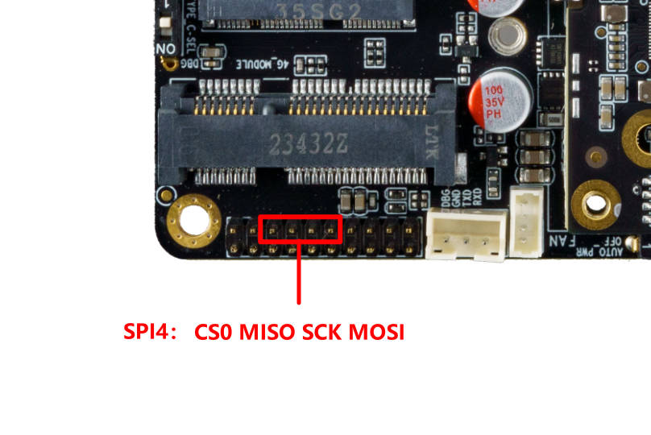

# SPI

## Introduction

SPI is a high-speed, full-duplex, synchronous serial communication interface for connecting microcontrollers, sensors, storage devices, etc. The AIO-3576JD4 development board provides the SPI interface, and the specific position is as follows:




The prints on PCB shows it is SPI3, but actually it is SPI4.

It is because this motherboard support different coreboard, when it match with Core-3576JD4, then the actual SPI is SPI4.


## How SPI works

SPI works in a master-slave mode, which typically has one master device and one or more slave devices, requiring at least four wires, respectively:

```
CS		    slice selection signal
SCLK		clock letter
MOSI		master device data output and slave device data input
MISO		master device data input and slave device data output
```

The Linux kernel uses a combination of CPOL and CPHA to represent the four working modes of the current SPI:

```
CPOL＝0，CPHA＝0		SPI_MODE_0
CPOL＝0，CPHA＝1		SPI_MODE_1
CPOL＝1，CPHA＝0		SPI_MODE_2
CPOL＝1，CPHA＝1		SPI_MODE_3
```

* **CPOL :** Represents the state of the initial level of the clock signal, 0 is the low level and 1 is the high level.
* **CPHA :** Is sampling along which clock, 0 is sampling along the first clock and 1 is sampling along the second clock.

The waveforms of SPI's four working modes are as follows:


## Interface usage

Linux provides a SPI user interface with limited functionality. If IRQ or other kernel driver interfaces are not required, consider using `spidev` interface to write user-level programs to control SPI devices. The corresponding path in the AIO-3576JD4 development board is `/dev/spidev1.0`.

`spidev` corresponding driver code is `kernel-5.10/drivers/spi/spidev.c`.

The config in the kernel needs to select `SPI_SPIDEV`:

```
 │ Symbol: SPI_SPIDEV [=y]
 │ Type  : tristate
 │ Prompt: User mode SPI device driver support
 │   Location:
 │     -> Device Drivers
 │       -> SPI support (SPI [=y])
 │   Defined at drivers/spi/Kconfig:684
 │   Depends on: SPI [=y] && SPI_MASTER [=y]
```

DTS configuration like follows:

```
&spix{
    status = "okay";
    max-freq = <50000000>;
    spidev1: spidev@00{
        compatible = "rockchip,spidev";
        status = "okay";
        reg = <0x0>;
        spi-max-frequency = <50000000>;
    };
};
```
Please refer to `kernel-5.10/Documentation/spi/spidev.rst` for detailed instructions.

## FAQs

### Q1: SPI data transfer exception?

**A1 :** Make sure the `IOMUX` configuration of SPI 4 pins is correct. Confirm that when TX sends data, TX pins have normal waveform, CLK frequency is correct, CS signal is pulled down, and mode matches the device.
