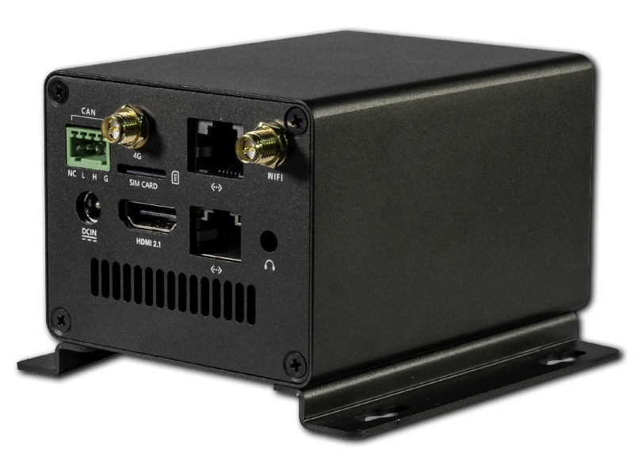
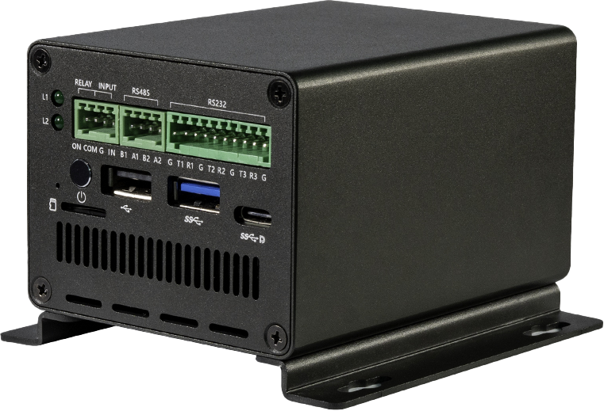
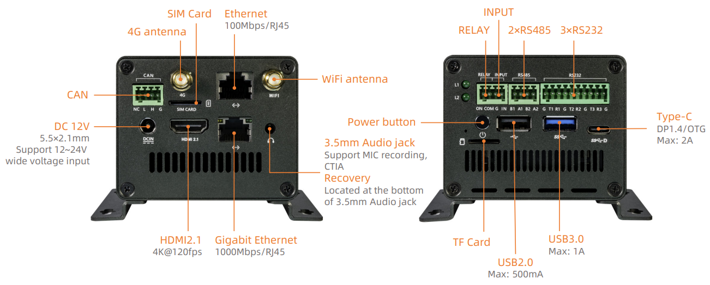
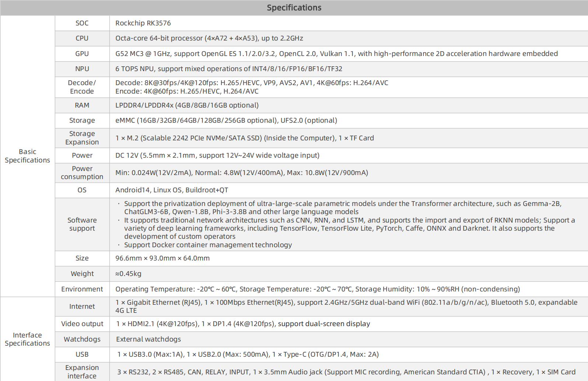
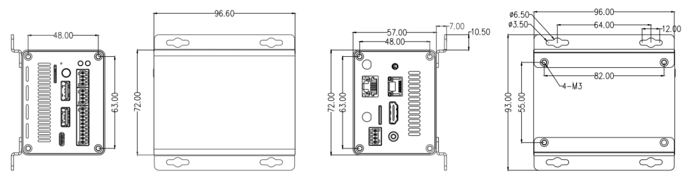

# Product Introduction

**EC-R3576PC** Powered by the Rockchip RK3576, an octa-core 64-bit AIOT processor, EC-R3576PC FD features an advanced lithography process to deliver high performance while maintaining low power consumption. It is equipped with an ARM Mali G52 MC3 GPU and a 6 TOPS NPU, supporting the private deployment of large-scale models under the Transformer architecture. With support for 4K@120fps decoding/4K@60fps encoding, the computer boasts a powerful display capability with 4K resolution at a high frame rate of 120 fps. Its industrial-grade metal enclosure and fanless design enable passive cooling. With an external watchdog, it provides industrial-grade stability, making it an excellent choice for AI applications requiring local deployment.

## Specification

## Size

## Resources

* [Download Page](https://en.t-firefly.com/doc/download/229.html) Includes firmware, rootfs and tools download links.
* [Forum](https://bbs.t-firefly.com/forum.php?mod=forumdisplay&fid=100) Tech communication platform for over 100K company and individual customers.

## Support

Contact E-commerce customer service or post on forum for general supports. Professional tech supports or detail informations please contact us:

* Email: sales@t-firefly.com
* Mobile: (+86) 186 8811 7175
* Landline: 0760-89881218
* Service Hotline: 4001-511-533
* Address: Room 2101, Hongyu Building, No. 57 Zhongshan 4th Road, East District, Zhongshan City, Guangdong Province
 