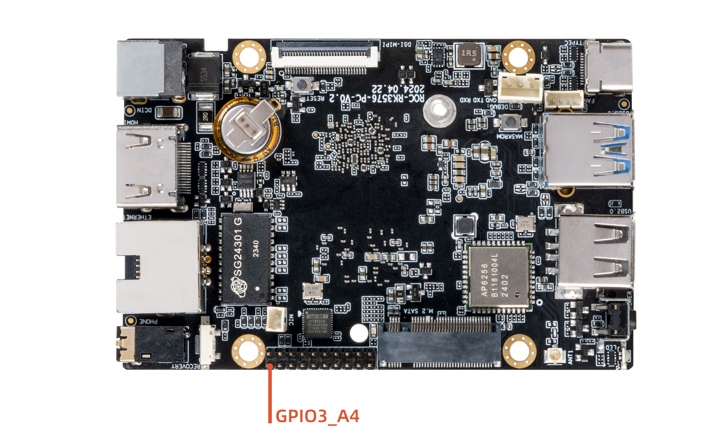

# GPIO

## Introduction

GPIO (General-Purpose Input/Output) is a General pin that can be dynamically configured and controlled during software operation.The initial state of all GPIOs after power-on is input mode, which can be set as pull-up or pull-down or interrupt pin by software. The driving intensity is programmable, and the core of which is to fill the methods and parameters of GPIO bank and register them in the kernel by calling gpiochip_add.


ROC-RK3576-PC development board in order to facilitate user development and use, Leads to GPIO oral for user debugging and development, can use GPIO3_A4


This article uses the two general GPIO ports GPIO0_C1 and GPIO0_C2 as examples to write a simple operation GPIO port driver. The path in the SDK is:


```
kernel/drivers/gpio/gpio-firefly.c
```

The following takes this driver as an example to introduce the operation of GPIO.


## GPIO Pin to calculate
ROC-RK3576-PC have 5  GPIO bank：GPIO0~GPIO4，Each group was numbered A0~A7, B0~B7, C0~C7, and D0~D7, the following formulas are often used to calculate GPIO Pin:

```
GPIO pin calculation formula：pin = bank * 32 + number 

GPIO group number calculation formula：number = group * 8 + X
```
For example, if we want to calculate GPIO Pin GPIO0_C1, we could refer to the following step: 

bank = 0;  &nbsp;&nbsp;&nbsp;&nbsp;&nbsp;//GPIO<font color=red>0</font>_C1 => 0,  bank ∈ [0,4]

group = 2;  &nbsp;&nbsp;&nbsp;&nbsp;&nbsp;//GPIO0_<font color=red>C</font>1 => 2,  group ∈ {(A=0), (B=1), (C=2), (D=3)}

X = 1;    &nbsp;&nbsp;&nbsp;&nbsp;&nbsp;&nbsp;//GPIO0_C<font color=red>1</font> => 1, X ∈ [0,7]

number = group * 8 + X = 2 * 8 + 1 = 17

pin = bank*32 + number= 0 * 32 + 17 = 17;

GPIO0_C1 property of dts is described as :<&gpio0 17 GPIO_ACTIVE_HIGH>, by `kernel/include/dt-bindings/pinctrl/rockchip.h` macro definition ，GPIO0_C1 can also be described as :<&gpio0 RK_PC1 GPIO_ACTIVE_HIGH>

```
#define RK_PA0    0
#define RK_PA1    1
#define RK_PA2    2
#define RK_PA3    3
#define RK_PA4    4
#define RK_PA5    5
#define RK_PA6    6
#define RK_PA7    7
#define RK_PB0    8
#define RK_PB1    9
#define RK_PB2    10
#define RK_PB3    11
......
```
When GPIO0_C1 pin is not reused by other peripherals, we can export this pin to use
```shell
:/ # ls /sys/class/gpio/
export     gpiochip128  gpiochip509  gpiochip96
gpiochip0  gpiochip32   gpiochip64   unexport
:/ # echo 17 > /sys/class/gpio/export
:/ # ls /sys/class/gpio/gpio17
active_low  device  direction  edge  power  subsystem  uevent  value
:/ # cat /sys/class/gpio/gpio17/direction
in
:/ # cat /sys/class/gpio/gpio17/value
0
```
## input Output

First add the resource description of the driver in the DTS file:

```
kernel/arch/arm64/boot/dts/rockchip/rk3576-firefly-demo.dtsi

/{
    gpio_demo: gpio_demo{
        compatible = "firefly,rk3576-gpio";
        status = "okay";
        pinctrl-names = "default";
        pinctrl-0 = <&pin17_18_gpio>;
        firefly-gpio = <&gpio0 RK_PC1 GPIO_ACTIVE_HIGH>;             /*GPIO0_C1*/
        firefly-irq-gpio = <&gpio0 RK_PC2 IRQ_TYPE_EDGE_RISING>;     /*GPIO0_C2*/
    };
};

&pinctrl {
    gpio{
        pin17_18_gpio: pin17_18_gpio{
            rockchip,pins =
            <0 RK_PC1 0 &pcfg_pull_none>,
            <0 RK_PC2 0 &pcfg_pull_none>;			
        };
    };
};
```

Here defines a pin as a general output and input port:

```
firefly-gpio GPIO0_C1
```

`GPIO_ACTIVE_HIGH` means high level is active, if you want low level to be active, you can change it to: `GPIO_ACTIVE_LOW`, this attribute will be read by the driver.

Then analyze the resources added by DTS in the probe function, the code is as follows:

```
static int firefly_gpio_probe(struct platform_device *pdev)
{
	int ret;
	int gpio;
	enum of_gpio_flags flag;
	struct firefly_gpio_info *gpio_info;
	struct device_node *firefly_gpio_node = pdev->dev.of_node;

	printk("Firefly GPIO Test Program Probe\n");
	gpio_info = devm_kzalloc(&pdev->dev,sizeof(struct firefly_gpio_info *), GFP_KERNEL);
	if (!gpio_info) {
		return -ENOMEM;
	}
	gpio = of_get_named_gpio_flags(firefly_gpio_node, "firefly-gpio", 0, &flag);
	if (!gpio_is_valid(gpio)) {
		printk("firefly-gpio: %d is invalid\n", gpio); return -ENODEV;
	}
	if (gpio_request(gpio, "firefly-gpio")) {
		printk("gpio %d request failed!\n", gpio);
		gpio_free(gpio);
		return -ENODEV;
	}
	gpio_info->firefly_gpio = gpio;
	gpio_info->gpio_enable_value = (flag == OF_GPIO_ACTIVE_LOW) ? 0:1;
	gpio_direction_output(gpio_info->firefly_gpio, gpio_info->gpio_enable_value);
	printk("Firefly gpio putout\n");
	...
}
```

`of_get_named_gpio_flags` reads the GPIO configuration numbers and flags of `firefly-gpio` and `firefly-irq-gpio` from the device tree, `gpio_is_valid` judges whether the GPIO number is valid, and `gpio_request` applies to occupy the GPIO. If there is an error in the initialization process, you need to call `gpio_free` to release the previously applied and successful GPIO. Call `gpio_direction_output` in the driver to set the output high or low level. Here the default output is the active level `GPIO_ACTIVE_HIGH` obtained from DTS, which is high level. If the drive works normally, you can use a multimeter to measure the corresponding The pin should be high. In practice, if you want to read GPIO, you need to set it to input mode first, and then read the value:

```
int val;
gpio_direction_input(your_gpio);
val = gpio_get_value(your_gpio);
```

The following are commonly used GPIO API definitions:

```
#include <linux/gpio.h>
#include <linux/of_gpio.h>

enum of_gpio_flags {
     OF_GPIO_ACTIVE_LOW = 0x1,
};
int of_get_named_gpio_flags(struct device_node *np, const char *propname,
int index, enum of_gpio_flags *flags);
int gpio_is_valid(int gpio);
int gpio_request(unsigned gpio, const char *label);
void gpio_free(unsigned gpio);
int gpio_direction_input(int gpio);
int gpio_direction_output(int gpio, int v);
```

## Interrupt

The Firefly example program also contains an interrupt pin. The interrupt usage of the GPIO port is similar to the input and output of GPIO. First, add the resource description of the driver in the DTS file:

```
kernel/arch/arm64/boot/dts/rockchip/rk3588-firefly-demo.dtsi
gpio {
  compatible = "firefly-gpio";
	firefly-irq-gpio = <&gpio0 RK_PC2 IRQ_TYPE_EDGE_RISING>;     /*GPIO0_C2*/
};
```

IRQ_TYPE_EDGE_RISING indicates that the interrupt is triggered by the rising edge, and the interrupt function can be triggered when the pin receives the rising edge signal.This can also be configured as follows：

```
IRQ_TYPE_NONE           //Default value, no defined interrupt trigger type
IRQ_TYPE_EDGE_RISING    //Rising edge trigger
IRQ_TYPE_EDGE_FALLING   //Falling edge trigger
IRQ_TYPE_EDGE_BOTH      //Trigger on both rising and falling edges
IRQ_TYPE_LEVEL_HIGH     //High level trigger
IRQ_TYPE_LEVEL_LOW      //Low level trigger
```

Then analyze the resources added by DTS in the probe function, and then apply for interrupted registration, the code is as follows:

```
static int firefly_gpio_probe(struct platform_device *pdev)
{
	int ret;
	int gpio;
	enum of_gpio_flags flag;
	struct firefly_gpio_info *gpio_info;
	struct device_node *firefly_gpio_node = pdev->dev.of_node;
	...

	gpio_info->firefly_irq_gpio = gpio;
	gpio_info->firefly_irq_mode = flag;
	gpio_info->firefly_irq = gpio_to_irq(gpio_info->firefly_irq_gpio);
	if (gpio_info->firefly_irq)
	{
		if (gpio_request(gpio, "firefly-irq-gpio"))
		{
			dev_err(&pdev->dev, "firefly-irq-gpio: %d request failed!\n", gpio);
			gpio_free(gpio);
			return IRQ_NONE;
		}

		ret = request_irq(gpio_info->firefly_irq, firefly_gpio_irq,
							flag, "firefly-gpio", gpio_info);
		if (ret != 0)
		{
			free_irq(gpio_info->firefly_irq, gpio_info);
			dev_err(&pdev->dev, "Failed to request IRQ: %d\n", ret);
		}
	}
	printk("Firefly irq gpio finish \n");
	return 0;
}

static irqreturn_t firefly_gpio_irq(int irq, void *dev_id) //interrupt function
{
	printk("Enter firefly gpio irq test program!\n");
	return IRQ_HANDLED;
}
```

Call `gpio_to_irq` to convert the PIN value of the GPIO to the corresponding IRQ value, call `gpio_request` to apply for the IO port, call `request_irq` to apply for an interrupt, if it fails, call `free_irq` to release, in this function `gpio_info-firefly_irq` Is the hardware interrupt number to be applied for, `firefly_gpio_irq` is the interrupt function, `gpio_info->firefly_irq_mode` is the attribute of interrupt processing, `firefly-gpio` is the name of the device driver, and `gpio_info` is the `device` structure of the device. It is used when registering shared interrupts.

## Reuse

`For reference only, the actual hardware interfaces prevail.`

In addition to general input/output and interrupt functions, GPIO port may also have other reuse functions, such as GPIO1_D0, which has the following functions:

|  func0  |  func1  |  func2  |  func3  |
| --- | --- | --- | --- | 
| GPIO0_C1 | UART8_TX_M2 |  I2C0_SCL_M1 | I3C0_SCL_M0 |

When using GPIO port, it is necessary to pay attention to whether it is reused for other functions. Here, you can use IO command to check the IOMUX to judge whether it is reused or not. It is explained in the section of Debugging Methods, but it will not be explained here.
If GPIO0_C1 are found to be reused as I2C0_SDA through IO command, the I2C disabled shall be removed when GPIO0_C1 are used as GPIO or other functions.  

```
&i2c0 {
    status = "disabled";
};

gpio_demo: gpio_demo {
    status = "okay";
    compatible = "firefly,rk3576-gpio";
    firefly-gpio = <&gpio0 RK_PC1 GPIO_ACTIVE_HIGH>;          /* GPIO0_C1 */
};
```
**Note:** This **GPIO0_C1** is for example only and is not recommended for practical use

The above mentioned changes on DTS, but how do you switch functions at run time?The following take I2C7_M0 as an example for a simple introduction, detailed introduction can be referred to `RKDocs/common/PIN-Ctrl/Rockchip-Developer-Guide-Linux-Pin-Ctrl-CN.pdf`.

According to the specification table, the functions of I2C7_SDA_M0 and I2C7_SCL_M0 are defined as follows:

|  Pad#  |  func0  |  func1  |  func2  |
| --- | --- | --- | --- |
| GPIO0_C1 | UART8_TX_M2 |  I2C0_SCL_M1 | I3C0_SCL_M0 |
| GPIO0_C2 | UART8_RX_M2  |  I2C0_SDA_M1 | I3C0_SDA_M0 |

In `kernel/arch/arm64/boot/dts/rockchip/rk3576.dtsi` there are:

```
i2c0: i2c@27300000 {
	  compatible = "rockchip,rk3576-i2c", "rockchip,rk3399-i2c";
	  reg = <0x0 0x27300000 0x0 0x1000>;
	  clocks = <&cru 502>, <&cru 501>;
	  clock-names = "i2c", "pclk";
	  interrupts = <0 88 4>;
	  pinctrl-names = "default";
	  pinctrl-0 = <&i2c0m0_xfer>;
	  resets = <&cru 524371>, <&cru 524369>;
	  reset-names = "i2c", "apb";
	  #address-cells = <1>;
	  #size-cells = <0>;
	  status = "disabled";
 };
```

Related to multiplexing control is the attribute at the beginning of `pinctrl-`:

* pinctrl-names defines a list of state names: default (i2c function) and gpio two states.
* pinctrl-0 defines the pinctrl that needs to be set in state 0 (ie default): &i2c0m0_xfer
* pinctrl-1 defines the pinctrl that needs to be set in state 1 (i.e. gpio): &i2c0m1_gpio

These pinctrls are defined in `kernel/arch/arm64/boot/dts/rockchip/rk3588-pinctrl.dtsi` as follows:

```
pinctrl: pinctrl {
		compatible = "rockchip,rk3576-pinctrl";
		rockchip,grf = <&ioc_grf>;
		rockchip,sys-grf = <&sys_grf>;
		#address-cells = <2>;
		#size-cells = <2>;
	...
};
```

I2c0 is defined in `kernel/arch/arm64/boot/dts/rockchip/rk3576-pinctrl.dtsi`

```
i2c0m1_xfer: i2c0m1-xfer {
	   rockchip,pins =

	    <0 17 9 &pcfg_pull_none_smt>,

	    <0 18 9 &pcfg_pull_none_smt>;
	  };
};
```

RK_FUNC_GPIO is defined in  `kernel-5.10/include/dt-bindings/pinctrl/rockchip.h`,Here they are simply written as 0 and 1：

```
 #define RK_FUNC_GPIO    0
```

After knowing the above definition of i2c7, click `kernel-5.10/arch/arm64/boot/dts/rockchip/rk3588-firefly-demo.dtsi` and add GPIO resources for i2c7 nodes in dtsi

```
&i2c0 {
    status = "okay";
    pinctrl-names = "default","i2c0_gpio";
    pinctrl-1 = <&i2c0m1_gpio>;
    gpios = <&gpio0 RK_PC1 GPIO_ACTIVE_HIGH>,<&gpio0 RK_PC2 GPIO_ACTIVE_HIGH>;
};

&pinctrl {
    i2c0{
        /omit-if-no-ref/
        i2c0m1_gpio: i2c0m1-gpio{
        rockchip,pins =
            /* i2c0_gpio0_c1 */
            <0 RK_PC1 0 &pcfg_pull_none>,
            /* i2c0_gpio0_c2 */
            <0 RK_PC2 0 &pcfg_pull_none>; 
        };
    }; 
};
```

The I2C driver registration process is as follows:
```
rk3x_i2c_driver_init
    platform_driver_register
        driver_register
            bus_add_driver
                driver_attach
                    bus_for_each_dev
                        __driver_attach
                            device_driver_attach
                                driver_probe_device
                                    really_probe
                                        pinctrl_bind_pins
                                            pinctrl_select_state
```
`pinctrl_select_state` is a function to select pinctrl in dts. 


## Debugging method
### GPIO debug interface

The purpose of the Debugfs file system is to provide developers with more kernel data to facilitate debugging. Here GPIO debugging can also use the Debugfs file system to get more kernel information. The interface of GPIO in the Debugfs file system is `/sys/kernel/debug/gpio`, the information of this interface can be read like this:

```
console:/ $ cat sys/kernel/debug/gpio                                          
gpiochip0: GPIOs 0-31, parent: platform/fd8a0000.gpio, gpio0:
 gpio-0   (                    |bt_default_wake_host) in  lo 
 gpio-21  (                    |bt_default_wake     ) in  lo 
 gpio-22  (                    |bt_default_reset    ) out lo 

gpiochip1: GPIOs 32-63, parent: platform/fec20000.gpio, gpio1:
 gpio-34  (                    |bt_default_rts      ) in  hi 
 gpio-36  (                    |hpd                 ) in  lo 
 gpio-43  (                    |:power              ) out hi 
 gpio-44  (                    |reset               ) out hi 
 gpio-52  (                    |hp-det              ) in  hi ACTIVE LOW
 gpio-56  (                    |firefly-gpio        ) out hi 
 gpio-57  (                    |firefly-irq-gpio    ) in  hi 
 gpio-61  (                    |hdmirx-det          ) in  hi ACTIVE LOW
 ...
```
From the information read, the kernel lists the current status of GPIO. Taking gpio1 group as an example, gpio-56 (gpio1_d0) outputs high level (out HI).

### pinmux-pins
Command: 
```
:/ # cat /d/pinctrl/pinctrl-rockchip-pinctrl/pinmux-pins
``` 

Result:
```
Pinmux settings per pin 
Format: pin (name): mux_owner gpio_owner hog? 
pin 0 (gpio0-0): wireless-bluetooth gpio0:0 function wireless-bluetooth group bt-irq-gpio    
pin 1 (gpio0-1): (MUX UNCLAIMED) (GPIO UNCLAIMED)                                    
pin 2 (gpio0-2): (MUX UNCLAIMED) (GPIO UNCLAIMED)        
pin 3 (gpio0-3): (MUX UNCLAIMED) (GPIO UNCLAIMED)       
pin 4 (gpio0-4): fe2c0000.mmc (GPIO UNCLAIMED) function sdmmc group sdmmc-det   
...
```
interpret：
The column "pin 0" indicates the pin number, `gpio0-0 "indicates the GPIO group number, and the following list" MUX unclaimed "indicates the owner of the data selector.

Where 'MUX unclaimed' means that the pin has not been controlled by the node using pinctrl. For example, node i2c7 is enabled,

It has the pinctrl-0 attribute. The pin 56 function is modified. If it is multiplexed to I2C, the pin information will change to `pin 56 (gpio1-24): fec90000.i2c (GPIO UNCLAIMED) function i2c7 group i2c7m0-xfer`, which is configured by the node with address 0xfec90000 and name I2C using pinctrl. The value of pinctrl is i2cm0-xfer.

"GPIO UNCLAIMED" indicates that the pin is used by GPIO that has not been registered. We use the above gpio_demo example to register this pin. The pin information will become "gpio_demo gpio1:56 function gpio group pin56_57_gpio", which is called gpio_demo node is configured with pinctrl. The value of pinctrl is pin56_57_gpio, this pin is also applied as GPIO.


## FAQs

### Q1: How to switch the MUX value of PIN to normal GPIO?

A1: When using GPIO request, the MUX value of the PIN will be forcibly switched to GPIO, so when using the PIN pin as a GPIO function, make sure that the PIN pin is not used by other modules.

### Q2: Why is the value I read out with the IO instruction is 0x00000000?

A2: If you use the IO command to read the register of a GPIO, the value read is abnormal, such as 0x00000000 or 0xffffffff, etc., please confirm whether the CLK of the GPIO is turned off. The CLK of the GPIO is controlled by the CRU. You can read the datasheet Next, use the CRU_CLKGATE_CON* register to check whether the CLK is turned on. If it is not turned on, you can use the io command to set the corresponding register to turn on the corresponding CLK. After turning on the CLK, you should be able to read the correct register value.

### Q3: How to check if the voltage of the PIN pin is wrong?

A3: When measuring the voltage of the PIN pin is incorrect, if external factors are excluded, you can confirm whether the IO voltage source where the PIN is located is correct and whether the IO-Domain configuration is correct.

### Q4: What is the difference between gpio_set_value() and gpio_direction_output()?

A4: If you do not dynamically switch input and output when using this GPIO, it is recommended to set the GPIO output direction at the beginning, and use the gpio_set_value() interface when pulling it up and pulling it down later. It is not recommended to use gpio_direction_output() because of the gpio_direction_output interface There is a mutex lock inside, there will be an error exception when calling the interrupt context, and compared to gpio_set_value, gpio_direction_output does more and is wasteful.
