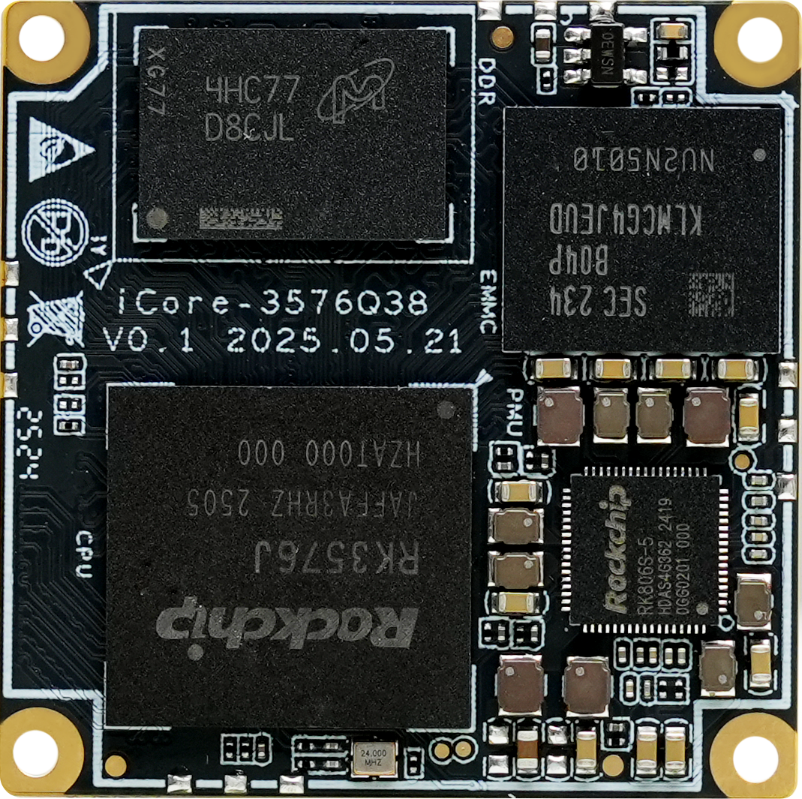
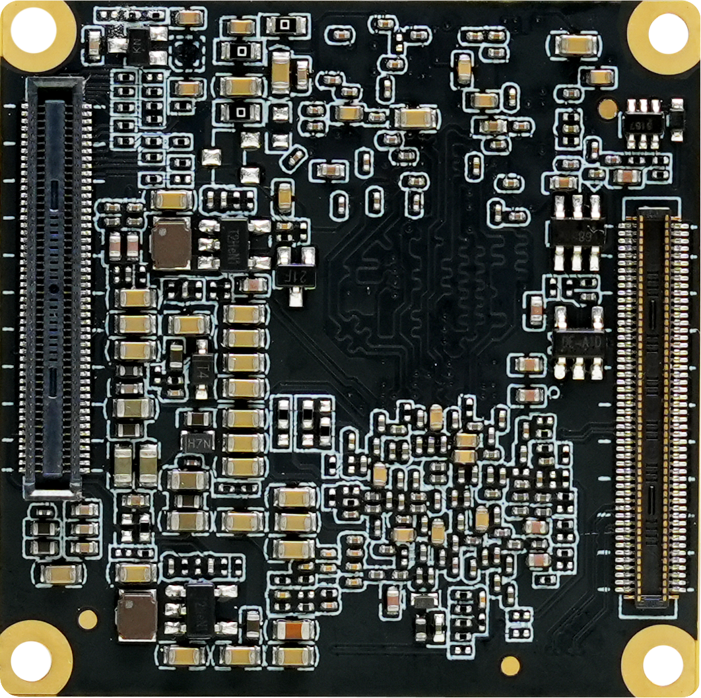
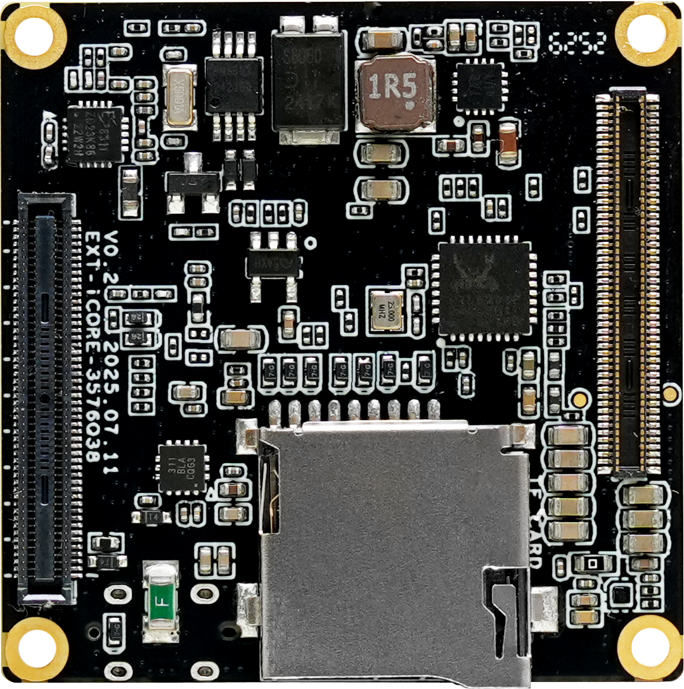

# Introduction
**iCore-3576Q38** Equipped with Rockchip octa-core AIoT processor RK3576, supports private deployment of modern mainstream large models and decoding of up to 8K video. With a compact size of just 38 × 38mm, this SoM integrates 6 TOPS NPU and features industrial-grade innovations such as real-time networking, Flexbus, hardware resource isolation, and DSMC.

** **
**Can be matched with the development of baseboard EXT-iCore-3576Q38**

 