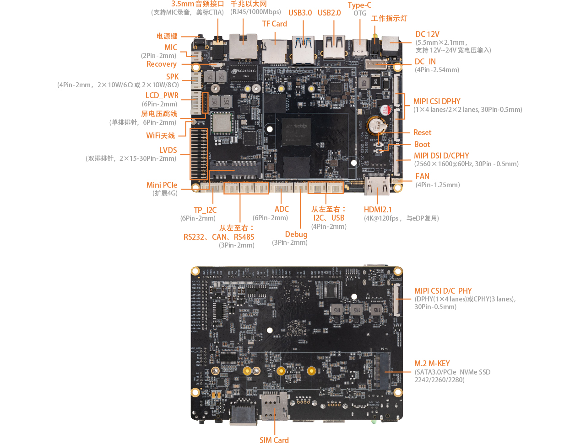

# 接口定义

## 整机接口定义

**AIO-3576C V1.0** 使用的接口，主要包括：

* 1 x HDMI2.1（最大支持 4K@120Hz 输出）
* 1 x USB3.0 OTG(Type-C)
* 1 x USB3.0
* 2 x USB2.0 (其中一个4P-1.25mm)
* 1 x MIPI-DSI
* 1 x MIPI-D/CPHY-CSI
* 2 x MIPI-DPHY-CSI
* 1 x TF Card
* 1 x M.2 (SATA3.1 / NVME)
* 1 x WIFI
* 1 x Bluetooth
* 1 x FAN
* 1 x RJ45（支持 1Gbps）
* 1 × 3.5mm 耳机接口
* 1 × Mic输入（2P-1.25mm）
* 1 × SPEAKER（4P-1.25mm）
* 1 x DEBUG TTL
* 1 x RS485
* 1 x RS232
* 1 x CAN
* 1 x Mini PCIe (4G 模块)
* 1 x eDP 40Pin/30Pin (默认不支持，与HDMI复用)

具体如下图：

## 特殊接口说明
MIPI-DSI 和 LVDS 不能同时使用。

eDP 和 HDMI 复用，默认HDMI，如有需要eDP支持，可联系官方咨询。
