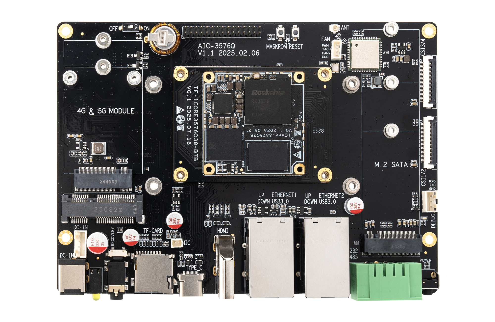

# 介绍
**AIO-3576Q38**配置 Rockchip 八核 64 位 AIOT 处理器 RK3576，采用先进工艺制程，高性能低功耗，内置 ARM Mali G52 MC3 GPU，集成6 TOPS算力NPU，支持主流大模型的私有化部署。同时支持4K@120fps解码/4K@60fps 编码，具备 4K@120fps 高清高帧率显示能力，支持外部看门狗，具有实时网络、Flexbus、硬件资源隔离、DSMC等工业新特性，满足不同的工业应用需求。

 