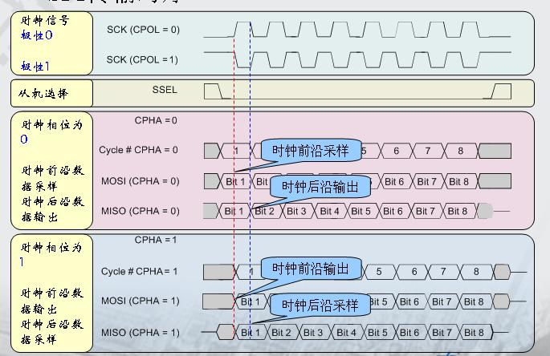

# SPI 使用

## SPI 简介

SPI 是一种高速的，全双工，同步串行通信接口，用于连接微控制器、传感器、存储设备等。 AIO-3576JD4 开发板提供了 SPI 接口，具体位置如下图：


丝印是 SPI3，但实际为 SPI4，原因是该底板可兼容不同核心板，在搭配 Core-3576JD4 时实际为 SPI4


## SPI 工作方式

SPI 以主从方式工作，这种模式通常有一个主设备和一个或多个从设备，需要至少 4 根线，分别是：

```
CS	    	片选信号
SCLK		时钟信号
MOSI		主设备数据输出、从设备数据输入
MISO		主设备数据输入，从设备数据输出
```

Linux 内核用 CPOL 和 CPHA 的组合来表示当前 SPI 的四种工作模式：

```
CPOL＝0，CPHA＝0		SPI_MODE_0
CPOL＝0，CPHA＝1		SPI_MODE_1
CPOL＝1，CPHA＝0		SPI_MODE_2
CPOL＝1，CPHA＝1		SPI_MODE_3
```

* CPOL：表示时钟信号的初始电平的状态，0为低电平，1为高电平。
* CPHA：表示在哪个时钟沿采样，0为第一个时钟沿采样，1为第二个时钟沿采样。

SPI 的四种工作模式波形图如下：



## 接口使用

Linux 提供了一个功能有限的 SPI 用户接口，如果不需要用到 IRQ 或者其他内核驱动接口，可以考虑使用接口 `spidev` 编写用户层程序控制 SPI 设备。在 AIO-3576JD4开发板中对应的路径为： `/dev/spidev1.0`

spidev 对应的驱动代码：`kernel-5.10/drivers/spi/spidev.c`

内核 config 需要选上 SPI_SPIDEV：

```
 │ Symbol: SPI_SPIDEV [=y]
 │ Type  : tristate
 │ Prompt: User mode SPI device driver support
 │   Location:
 │     -> Device Drivers
 │       -> SPI support (SPI [=y])
 │   Defined at drivers/spi/Kconfig:684
 │   Depends on: SPI [=y] && SPI_MASTER [=y]
```

DTS 配置参考如下：
```
&spix {
    status = "okay";
    max-freq = <50000000>;
    spidev1: spidev@00{
        compatible = "rockchip,spidev";
        status = "okay";
        reg = <0x0>;
        spi-max-frequency = <50000000>;
    };
};
```
spidev的详细使用说明请参考文档`kernel-5.10/Documentation/spi/spidev.rst`

## FAQs

### Q1: SPI 数据传送异常

A1:  确保 SPI 4 个引脚的 `IOMUX` 配置正确， 确认 TX 送数据时，TX 引脚有正常的波形，CLK 频率正确，CS 信号有拉低，mode 与设备匹配。
