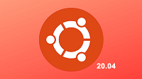
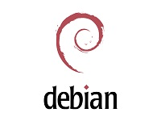

# 更多 Linux OS 支持

## Buildroot

Buildroot 是 Linux 平台上一个构建嵌入式 Linux 系统的框架。整个 Buildroot 是由 Makefile(*.mk) 脚本和 Kconfig(Config.in) 配置文件构成的。你可以和编译 Linux 内核一样，通过 buildroot 配置，menuconfig 修改，编译出一个完整的可以直接烧写到机器上运行的 Linux 系统软件（包含 boot、kernel、rootfs 以及 rootfs 中的各种库和应用程序）。

**Buildroot 是Firefly主要支持的OS之一，详细内容查看：**

- [《Firefly Buildroot 使用手册》](https://wiki.t-firefly.com/zh_CN/Firefly-Linux-Guide/manual_buildroot.html)
- [《Firefly Buildroot 开发手册》](https://wiki.t-firefly.com/zh_CN/Firefly-Linux-Guide/development_buildroot.html)

## Ubuntu 20.04
与最近的 LTS 前身 Ubuntu 18.04 相比，Ubuntu 20.04 带来了许多变化和明显的改进。随着时间的流逝，Canonical 的未来似乎变得温和光明，并点缀着更好的装饰品。对于所有 Ubuntu 爱好者，我们相信您会喜欢这个新版本，您可以在下面的链接中找到它。

**Ubuntu20.04 是Firefly主要支持的OS之一，详细内容查看：**

- [《Firefly Ubuntu 使用手册》](https://wiki.t-firefly.com/zh_CN/Firefly-Linux-Guide/manual_ubuntu.html)

## Debian 10

Debian 项目由 Ian Murdock 于1993年创立，是一个真正的免费社区项目。从那时起该项目已发展成为最大和最有影响力的开源项目之一。来自世界各地的数千名志愿者共同创建和维护 Debian 软件。Debian提供70种语言，支持多种计算机类型，因此其自称为通用操作系统。

**详细内容查看：**

- [《Firefly debian 使用手册》](https://wiki.t-firefly.com/zh_CN/Firefly-Linux-Guide/manual_debian.html)

