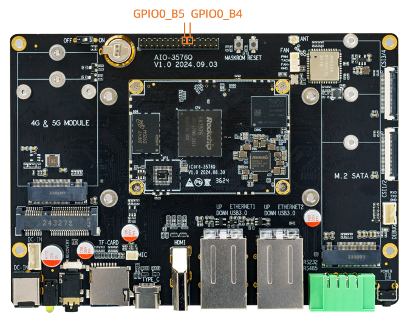

# GPIO 使用

## 简介

GPIO，全称 General-Purpose Input/Output（通用输入输出），是一种软件运行期间能够动态配置和控制的通用引脚。 所有的 GPIO 在上电后的初始状态都是输入模式，可以通过软件设为上拉或下拉，也可以设置为中断脚，驱动强度都是可编程的，其核心是填充 GPIO bank 的方法和参数，并调用 gpiochip_add 注册到内核中。


AIO-3576Q 开发板为了方便用户开发使用，引出了GPIO口供用户调试和开发，其对应引脚如下



本文以 GPIO0_B4  , GPIO0_B5 这两个 GPIO 口为例写一份简单操作 GPIO 口的驱动，在 SDK 的路径为 `kernel/drivers/gpio/gpio-firefly.c`,以下就以该驱动为例介绍 GPIO 的操作。


## GPIO引脚计算
iCore-3576Q 有 5 组 GPIO bank：GPIO0~GPIO4，每组又以 A0~A7, B0~B7, C0~C7, D0~D7 作为编号区分，常用以下公式计算引脚：

```shell
GPIO pin脚计算公式：pin = bank * 32 + number

GPIO 小组编号计算公式：number = group * 8 + X
```
下面演示GPIO0_B4 pin脚计算方法：

bank = 0;  &nbsp;&nbsp;&nbsp;&nbsp;&nbsp;//GPIO<font color=red>0</font>_B4 => 0,  bank ∈ [0,4]

group = 1;  &nbsp;&nbsp;&nbsp;&nbsp;&nbsp;//GPIO0_<font color=red>B</font>1 => 1,  group ∈ {(A=0), (B=1), (C=2), (D=3)}

X = 4;    &nbsp;&nbsp;&nbsp;&nbsp;&nbsp;&nbsp;//GPIO0_B<font color=red>4</font> => 4, X ∈ [0,7]

number = group * 8 + X = 1 * 8 + 4 = 12

pin = bank*32 + number= 0 * 32 + 12 = 12;

GPIO0_B4 对应的设备树属性描述为:<&gpio0 12 GPIO_ACTIVE_HIGH>,由`kernel/include/dt-bindings/pinctrl/rockchip.h`的宏定义可知，也可以将GPIO0_B4描述为<&gpio0 RK_PB4 GPIO_ACTIVE_HIGH>。

```
#define RK_PA0		0
#define RK_PA1		1
#define RK_PA2		2
#define RK_PA3		3
#define RK_PA4		4
#define RK_PA5		5
#define RK_PA6		6
#define RK_PA7		7
#define RK_PB0		8
#define RK_PB1		9
#define RK_PB2		10
#define RK_PB3		11
...
```
当GPIO0_B4 脚没有被其它外设复用时, 我们可以通过export导出该引脚去使用
```shell
:/ # ls /sys/class/gpio/
export     gpiochip128  gpiochip509  gpiochip96
gpiochip0  gpiochip32   gpiochip64   unexport
:/ # echo 12 > /sys/class/gpio/export
:/ # ls /sys/class/gpio/gpio12
active_low  device  direction  edge  power  subsystem  uevent  value
:/ # cat /sys/class/gpio/gpio12/direction
in
:/ # cat /sys/class/gpio/gpio12/value
0
```


## 输入输出

首先在 DTS 文件中增加驱动的资源描述：

```
kernel/arch/arm64/boot/dts/rockchip/rk3576-firefly-demo.dtsi

/{
    gpio_demo: gpio_demo{
        compatible = "firefly,rk3576-gpio";
        status = "okay";
        pinctrl-names = "default";
        pinctrl-0 = <&pin12_13_gpio>;
        firefly-gpio = <&gpio0 RK_PB4 GPIO_ACTIVE_HIGH>;             /*GPIO0_B4*/
        firefly-irq-gpio = <&gpio0 RK_PB5 IRQ_TYPE_EDGE_RISING>;     /*GPIO0_B5*/
    };
};

&pinctrl {
    gpio{
        pin12_13_gpio: pin12_13_gpio{
            rockchip,pins =
            <0 RK_PB4 0 &pcfg_pull_none>,
            <0 RK_PB5 0 &pcfg_pull_none>;			

        };
    };
};
```

这里定义了一个脚作为一般的输出输入口：

```
firefly-gpio GPIO0_B4
```

`GPIO_ACTIVE_HIGH` 表示高电平有效，如果想要低电平有效，可以改为：`GPIO_ACTIVE_LOW`，这个属性将被驱动所读取。

然后在 probe 函数中对 DTS 所添加的资源进行解析，代码如下：

```
static int firefly_gpio_probe(struct platform_device *pdev)
{
	int ret;
	int gpio;
	enum of_gpio_flags flag;
	struct firefly_gpio_info *gpio_info;
	struct device_node *firefly_gpio_node = pdev->dev.of_node;

	printk("Firefly GPIO Test Program Probe\n");
	gpio_info = devm_kzalloc(&pdev->dev,sizeof(struct firefly_gpio_info *), GFP_KERNEL);
	if (!gpio_info) {
		return -ENOMEM;
	}
	gpio = of_get_named_gpio_flags(firefly_gpio_node, "firefly-gpio", 0, &flag);
	if (!gpio_is_valid(gpio)) {
		printk("firefly-gpio: %d is invalid\n", gpio); return -ENODEV;
	}
	if (gpio_request(gpio, "firefly-gpio")) {
		printk("gpio %d request failed!\n", gpio);
		gpio_free(gpio);
		return -ENODEV;
	}
	gpio_info->firefly_gpio = gpio;
	gpio_info->gpio_enable_value = (flag == OF_GPIO_ACTIVE_LOW) ? 0:1;
	gpio_direction_output(gpio_info->firefly_gpio, gpio_info->gpio_enable_value);
	printk("Firefly gpio putout finish \n");
	...
}
```

`of_get_named_gpio_flags` 从设备树中读取 `firefly-gpio` 和 `firefly-irq-gpio` 的 GPIO 配置编号和标志，`gpio_is_valid` 判断该 GPIO 编号是否有效，`gpio_request` 则申请占用该 GPIO。如果初始化过程出错，需要调用 `gpio_free` 来释放之前申请过且成功的 GPIO 。在驱动中调用 `gpio_direction_output` 就可以设置输出高还是低电平，这里默认输出从 DTS 获取得到的有效电平 `GPIO_ACTIVE_HIGH`，即为高电平，如果驱动正常工作，可以用万用表测得对应的引脚应该为高电平。实际中如果要读出 GPIO，需要先设置成输入模式，然后再读取值：

```
int val;
gpio_direction_input(your_gpio);
val = gpio_get_value(your_gpio);
```

下面是常用的 GPIO API 定义：

```
#include <linux/gpio.h>
#include <linux/of_gpio.h>

enum of_gpio_flags {
	OF_GPIO_ACTIVE_LOW = 0x1,
};
int of_get_named_gpio_flags(struct device_node *np, const char *propname,
int index, enum of_gpio_flags *flags);
int gpio_is_valid(int gpio);
int gpio_request(unsigned gpio, const char *label);
void gpio_free(unsigned gpio);
int gpio_direction_input(int gpio);
int gpio_direction_output(int gpio, int v);
```

## 中断

在 Firefly 的例子程序中还包含了一个中断引脚，GPIO 口的中断使用与 GPIO 的输入输出类似，首先在 DTS 文件中增加驱动的资源描述：

```
kernel/arch/arm64/boot/dts/rockchip/rk3576-firefly-demo.dtsi
gpio {
	compatible = "firefly-gpio";
	firefly-irq-gpio = <&gpio0 RK_PB5 IRQ_TYPE_EDGE_RISING>;     /*GPIO0_B5*/
};
```

IRQ_TYPE_EDGE_RISING 表示中断由上升沿触发，当该引脚接收到上升沿信号时可以触发中断函数。 这里还可以配置成如下：

```
IRQ_TYPE_NONE         //默认值，无定义中断触发类型
IRQ_TYPE_EDGE_RISING  //上升沿触发
IRQ_TYPE_EDGE_FALLING //下降沿触发
IRQ_TYPE_EDGE_BOTH    //上升沿和下降沿都触发
IRQ_TYPE_LEVEL_HIGH   //高电平触发
IRQ_TYPE_LEVEL_LOW    //低电平触发
```

然后在 probe 函数中对 DTS 所添加的资源进行解析，再做中断的注册申请，代码如下：

```
static int firefly_gpio_probe(struct platform_device *pdev)
{
	int ret;
	int gpio;
	enum of_gpio_flags flag;
	struct firefly_gpio_info *gpio_info;
	struct device_node *firefly_gpio_node = pdev->dev.of_node;
	...

	gpio_info->firefly_irq_gpio = gpio;
	gpio_info->firefly_irq_mode = flag;
	gpio_info->firefly_irq = gpio_to_irq(gpio_info->firefly_irq_gpio);
	if (gpio_info->firefly_irq)
	{
		if (gpio_request(gpio, "firefly-irq-gpio"))
		{
			dev_err(&pdev->dev, "firefly-irq-gpio: %d request failed!\n", gpio);
			gpio_free(gpio);
			return IRQ_NONE;
		}

		ret = request_irq(gpio_info->firefly_irq, firefly_gpio_irq,
							flag, "firefly-gpio", gpio_info);
		if (ret != 0)
		{
			free_irq(gpio_info->firefly_irq, gpio_info);
			dev_err(&pdev->dev, "Failed to request IRQ: %d\n", ret);
		}
	}
	printk("Firefly irq gpio finish \n");
	return 0;
}

static irqreturn_t firefly_gpio_irq(int irq, void *dev_id) //中断函数
{
	printk("Enter firefly gpio irq test program!\n");
	return IRQ_HANDLED;
}
```

调用 `gpio_to_irq` 把 GPIO 的 PIN 值转换为相应的 IRQ 值，调用 `gpio_request` 申请占用该 IO 口，调用 `request_irq` 申请中断，如果失败要调用 `free_irq` 释放，该函数中 `gpio_info-firefly_irq` 是要申请的硬件中断号，`firefly_gpio_irq` 是中断函数，`gpio_info->firefly_irq_mode` 是中断处理的属性，`firefly-gpio` 是设备驱动程序名称，`gpio_info` 是该设备的 `device` 结构，在注册共享中断时会用到。

## 复用
`该案例仅供参考，最终以实际硬件接口为准`<br>
GPIO 口除了通用输入输出、中断功能外，还可能有其它复用功能，以GPIO0_C1为例，就有如下几个功能：

|  func0  |  func1  |  func2  |  func3  |
| --- | --- | --- | --- | 
| GPIO0_C1 | UART8_TX_M2 |  I2C0_SCL_M1 | I3C0_SCL_M0 |

查看 `/d/pinctrl/pinctrl-rockchip-pinctrl/pinmux-pins`，查看各个引脚的作用，如果发现GPIO0_C1被复用为I2c，则在dts中关闭它

```
&i2c0 {
    status = "disabled";
};

gpio_demo: gpio_demo {
    status = "okay";
    compatible = "firefly,rk3576-gpio";
    firefly-gpio = <&gpio0 RK_PC1 GPIO_ACTIVE_HIGH>;          /* GPIO0_C1 */
};
```
**Note:** 此处 **GPIO0_C1** 仅作示例，实际使用中不推荐如此修改

上面介绍了在DTS上修改，那在运行时又如何切换功能呢？下面以 I2C0_M1 为例作简单的介绍，详细介绍可以参考`RKDocs/common/PIN-Ctrl/Rockchip-Developer-Guide-Linux-Pin-Ctrl-CN.pdf`。

查规格表可知，I2C0_SCL_M1 与 I2C0_SDA_M1 的功能定义如下：

|  Pad#  |  func0  |  func1  |  func2  |
| --- | --- | --- | --- |
| GPIO0_C1 | UART8_TX_M2 |  I2C0_SCL_M1 | I3C0_SCL_M0 |
| GPIO0_C2 | UART8_RX_M2  |  I2C0_SDA_M1 | I3C0_SDA_M0 |

在 `kernel/arch/arm64/boot/dts/rockchip/rk3576.dtsi` 里有：

```
i2c0: i2c@27300000 {
	  compatible = "rockchip,rk3576-i2c", "rockchip,rk3399-i2c";
	  reg = <0x0 0x27300000 0x0 0x1000>;
	  clocks = <&cru 502>, <&cru 501>;
	  clock-names = "i2c", "pclk";
	  interrupts = <0 88 4>;
	  pinctrl-names = "default";
	  pinctrl-0 = <&i2c0m0_xfer>;
	  resets = <&cru 524371>, <&cru 524369>;
	  reset-names = "i2c", "apb";
	  #address-cells = <1>;
	  #size-cells = <0>;
	  status = "disabled";
 };
```

跟复用控制相关的是 `pinctrl-` 开头的属性：

* pinctrl-names 定义了状态名称列表： default (i2c 功能) 和 gpio 两种状态。
* pinctrl-0 定义了状态 0 (即 default）时需要设置的 pinctrl: &i2c0m0_xfer
* pinctrl-1 定义了状态 1 (即 gpio)时需要设置的 pinctrl: &i2c0m1_gpio

这些 pinctrl 在 `kernel/arch/arm64/boot/dts/rockchip/rk3576.dtsi` 中这样定义：

```
pinctrl: pinctrl {
		compatible = "rockchip,rk3576-pinctrl";
		rockchip,grf = <&ioc_grf>;
		rockchip,sys-grf = <&sys_grf>;
		#address-cells = <2>;
		#size-cells = <2>;
	...
};
```

在`kernel/arch/arm64/boot/dts/rockchip/rk3576-pinctrl.dtsi`中有i2c0的定义

```
i2c0m1_xfer: i2c0m1-xfer {
	   rockchip,pins =

	    <0 17 9 &pcfg_pull_none_smt>,

	    <0 18 9 &pcfg_pull_none_smt>;
	  };
```

RK_FUNC_GPIO 的定义在 `kernel/include/dt-bindings/pinctrl/rockchip.h` ，此处简写作0：

```
#define RK_FUNC_GPIO	0
```

知道了上面关于i2c0的定义后，在 `kernel/arch/arm64/boot/dts/rockchip/rk3576-firefly-demo.dtsi` 中为i2c7节点添加gpio的资源

```
&i2c0 {
    status = "okay";
    pinctrl-names = "default","i2c0_gpio";
    pinctrl-1 = <&i2c0m1_gpio>;
    gpios = <&gpio0 RK_PC1 GPIO_ACTIVE_HIGH>,<&gpio0 RK_PC2 GPIO_ACTIVE_HIGH>;
};

&pinctrl {
    i2c0{
        /omit-if-no-ref/
        i2c0m1_gpio: i2c0m1-gpio{
        rockchip,pins =
            /* i2c0_gpio0_c1 */
            <0 RK_PC1 0 &pcfg_pull_none>,
            /* i2c0_gpio0_c2 */
            <0 RK_PC2 0 &pcfg_pull_none>; 
        };
    }; 
};
```

i2c驱动注册流程如下：
```
rk3x_i2c_driver_init
    platform_driver_register
        driver_register
            bus_add_driver
                driver_attach
                    bus_for_each_dev
                        __driver_attach
                            device_driver_attach
                                driver_probe_device
                                    really_probe
                                        pinctrl_bind_pins
                                            pinctrl_select_state
```
`pinctrl_select_state`是选择pinctrl的函数,它用来选择我们dts中设置的pinctrl。


## 调试方法


### GPIO 调试接口

Debugfs 文件系统目的是为开发人员提供更多内核数据，方便调试。 这里 GPIO 的调试也可以用 Debugfs 文件系统，获得更多的内核信息。GPIO 在 Debugfs 文件系统中的接口为 `/sys/kernel/debug/gpio`，可以这样读取该接口的信息：

```
console:/ $ cat sys/kernel/debug/gpio                                          
gpiochip0: GPIOs 0-31, parent: platform/fd8a0000.gpio, gpio0:
 gpio-0   (                    |bt_default_wake_host) in  lo 
 gpio-21  (                    |bt_default_wake     ) in  lo 
 gpio-22  (                    |bt_default_reset    ) out lo 

gpiochip1: GPIOs 32-63, parent: platform/fec20000.gpio, gpio1:
 gpio-34  (                    |bt_default_rts      ) in  hi 
 gpio-36  (                    |hpd                 ) in  lo 
 gpio-43  (                    |:power              ) out hi 
 gpio-44  (                    |reset               ) out hi 
 gpio-52  (                    |hp-det              ) in  hi ACTIVE LOW
 gpio-56  (                    |firefly-gpio        ) out hi 
 gpio-57  (                    |firefly-irq-gpio    ) in  hi 
 gpio-61  (                    |hdmirx-det          ) in  hi ACTIVE LOW
 ...
```

从读取到的信息中可以知道，内核把 GPIO 当前的状态都列出来了，以 GPIO1 组为例，gpio-56(GPIO1_D0) 输出高电平 (out hi)。

### 查看 pinmux-pins

使用命令 
```
:/ # cat /d/pinctrl/pinctrl-rockchip-pinctrl/pinmux-pins
``` 

得到结果
```
Pinmux settings per pin 
Format: pin (name): mux_owner gpio_owner hog? 
pin 0 (gpio0-0): wireless-bluetooth gpio0:0 function wireless-bluetooth group bt-irq-gpio    
pin 1 (gpio0-1): (MUX UNCLAIMED) (GPIO UNCLAIMED)                                    
pin 2 (gpio0-2): (MUX UNCLAIMED) (GPIO UNCLAIMED)        
pin 3 (gpio0-3): (MUX UNCLAIMED) (GPIO UNCLAIMED)       
pin 4 (gpio0-4): fe2c0000.mmc (GPIO UNCLAIMED) function sdmmc group sdmmc-det   
...
```
解析：
`pin 0`这一列表示引脚编号，`gpio0-0`这一列表示gpio组编号，后面`MUX UNCLAIMED`这一列表示数据选择器的拥有者，`GPIO UNCLAIMED`这一列表示gpio的拥有者。

其中 `MUX UNCLAIMED` 表示该引脚还没有被节点使用pinctrl去进行控制，例如：节点 i2c7 被启用，它拥有pinctrl-0属性，对引脚pin 56功能作出出修改，复用为i2c ，则该引脚的信息会变为`pin 56 (gpio1-24): fec90000.i2c (GPIO UNCLAIMED) function i2c7 group i2c7m0-xfer `，它被地址为0xfec90000、名字为i2c的节点使用pinctrl配置，pinctrl的值是i2cm0-xfer。

`GPIO UNCLAIMED`表示还没有注册的gpio使用该引脚，我们用上述gpio_demo例子去注册该引脚，引脚信息会变成`pin 56 (gpio1-24): gpio_demo gpio1:56 function gpio group pin56_57_gpio `，它被名为gpio_demo的节点使用pinctrl配置，pinctrl的值是pin56_57_gpio，该引脚还被申请为gpio。


## FAQs

### Q1: 如何将 PIN 的 MUX 值切换为一般的 GPIO？

A1: 当使用 GPIO request 时候，会将该 PIN 的 MUX 值强制切换为 GPIO，所以使用该 PIN 脚为 GPIO 功能的时候确保该 PIN 脚没有被其他模块所使用。

### Q2: 为什么我用 IO 指令读出来的值都是 0x00000000？

A2: 如果用 IO 命令读某个 GPIO 的寄存器，读出来的值异常,如 0x00000000 或 0xffffffff 等，请确认该 GPIO 的 CLK 是不是被关了，GPIO 的 CLK 是由 CRU 控制，可以通过读取 datasheet 下面 CRU_CLKGATE_CON* 寄存器来查到 CLK 是否开启，如果没有开启可以用 io 命令设置对应的寄存器，从而打开对应的 CLK，打开 CLK 之后应该就可以读到正确的寄存器值了。

### Q3: 测量到 PIN 脚的电压不对应该怎么查？

A3: 测量该 PIN 脚的电压不对时，如果排除了外部因素，可以确认下该 PIN 所在的 IO 电压源是否正确，以及 IO-Domain 配置是否正确。

### Q4: gpio_set_value() 与 gpio_direction_output() 有什么区别？

A4: 如果使用该 GPIO 时，不会动态的切换输入输出，建议在开始时就设置好 GPIO 输出方向，后面拉高拉低时使用 gpio_set_value() 接口，而不建议使用 gpio_direction_output(), 因为 gpio_direction_output 接口里面有 mutex 锁，对中断上下文调用会有错误异常，且相比 gpio_set_value，gpio_direction_output 所做事情更多，浪费。
